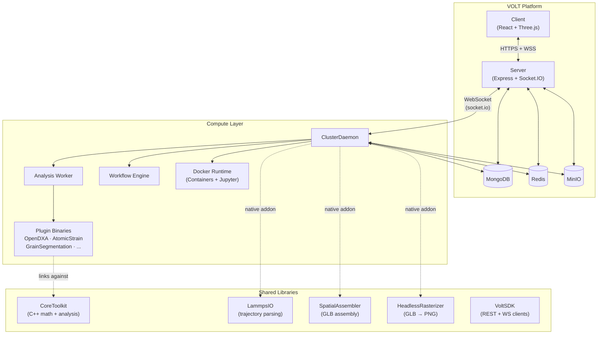
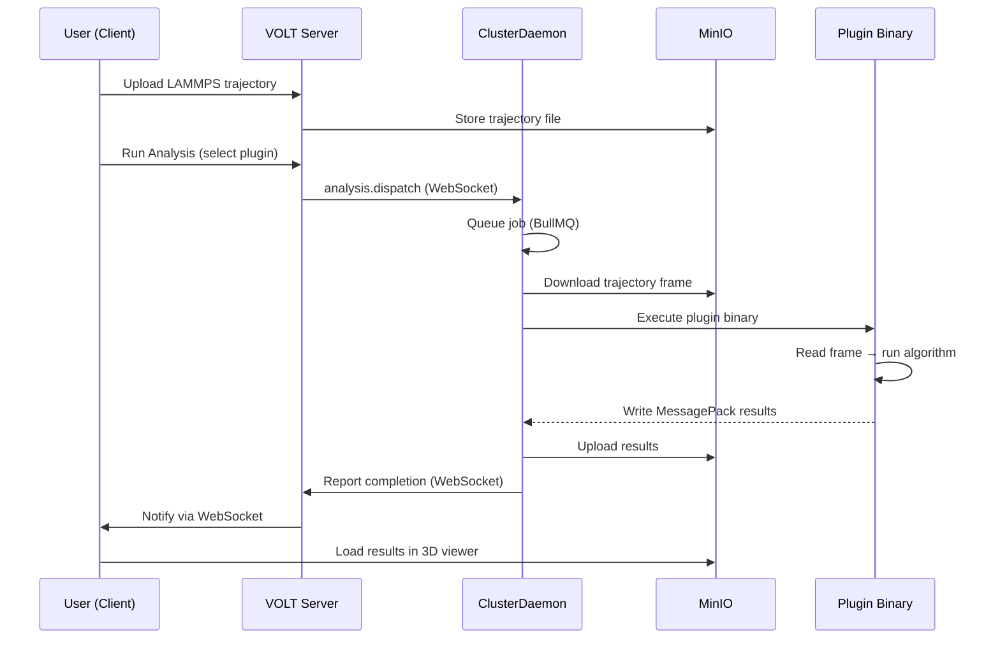

<Callout type="info">
**TL;DR** — VOLT has three layers: a web app (React + Express), a compute layer (ClusterDaemon on your machines), and shared C++ libraries. The server coordinates; your clusters do the heavy lifting. All communication uses WebSocket.
</Callout>

## System Overview

VOLT is a modular platform for high-performance molecular dynamics simulation analysis. The ecosystem is split into three layers: the **web platform**, the **compute layer**, and the **shared libraries**.

## Data Flow: Analysis Execution

Here's how a simulation analysis flows through the system:

## Components

### VOLT Platform (Web Application)

The main application, consisting of a **React** client and an **Express** server.

| Component | Technology | Purpose |
|---|---|---|
| **Client** | React 18, Three.js, Material-UI, Monaco Editor | UI, 3D visualization, code editing |
| **Server** | Express 5, Socket.IO, Passport.js | REST API, WebSocket gateway, OAuth |
| **MongoDB** | Mongoose ODM | Users, teams, simulations, analyses |
| **Redis** | ioredis + BullMQ | Job queues, caching, pub/sub |
| **MinIO** | S3-compatible | File storage (dumps, models, plugins, avatars) |

The server acts as the **coordinator**: it authenticates users, manages teams, and dispatches analysis jobs to cluster daemons via WebSocket.

### ClusterDaemon (Compute Node)

A Node.js service that runs on each compute node (a user's PC or a dedicated server). It connects to the VOLT server over **socket.io** and executes commands on behalf of the platform.

**Responsibilities:**
- Receive and execute analysis jobs (plugin binaries).
- Manage Docker containers and Jupyter notebook sessions.
- Parse and rasterize LAMMPS trajectories using native C++ addons.
- Report metrics (CPU, memory, disk) back to the platform.
- Handle SSH-based file imports.

<Callout type="info">
The daemon uses a reverse channel pattern — it does not expose any HTTP endpoints. The VOLT server sends commands through the WebSocket, and the daemon responds. This means you do not need to open inbound ports on your cluster machine.
</Callout>

### Plugin Binaries (Foundational Algorithms)

Standalone C++ executables compiled against **CoreToolkit**. Each plugin reads a LAMMPS dump frame, runs a specific analysis algorithm, and writes results in MessagePack format (a binary serialization format, like JSON but smaller and faster to parse).

There are currently **9 plugins**: OpenDXA, AtomicStrain, ElasticStrain, GrainSegmentation, StructureIdentification, ClusterAnalysis, CoordinationAnalysis, CentrosymmetryParameter, and DisplacementsAnalysis.

See [Plugin Development](/docs/open-source/plugin-development) for how to build your own.

### Shared Libraries

| Library | Type | Used by |
|---|---|---|
| **CoreToolkit** | C++ static library | All plugin binaries |
| **LammpsIO** | Node.js native addon | ClusterDaemon (trajectory parsing) |
| **SpatialAssembler** | Node.js native addon | ClusterDaemon (GLB generation) |
| **HeadlessRasterizer** | Node.js native addon | ClusterDaemon (thumbnail rendering) |
| **VoltSDK** | TypeScript + Python | External integrations, scripting |

### VoltSDK (Client Libraries)

Two client libraries for programmatic access to the VOLT API:

- **`@voltstack/voltclient`** (Node.js/Browser) — Typed HTTP client with auth presets, pagination, and a declarative service DSL.
- **`@voltstack/daemon-cluster-client`** (Node.js) — WebSocket client used by ClusterDaemon to communicate with the VOLT server.
- **`voltsdk`** (Python) — REST client for downloading analysis results, converting MessagePack to DataFrames, and viewing GLB models.

## Networking

| Connection | Protocol | Direction |
|---|---|---|
| Client ↔ Server | HTTPS + WSS | Bidirectional |
| Server → ClusterDaemon | WSS (socket.io) | Server initiates commands |
| ClusterDaemon → Server | WSS (socket.io) | Daemon sends heartbeats, results |
| ClusterDaemon → MinIO | HTTP(S) | Upload/download artifacts |
| ClusterDaemon → MongoDB | TCP | Store analysis metadata |
| ClusterDaemon → Redis | TCP | Job queues, caching |
| ClusterDaemon → Docker | Unix socket | Container management |
