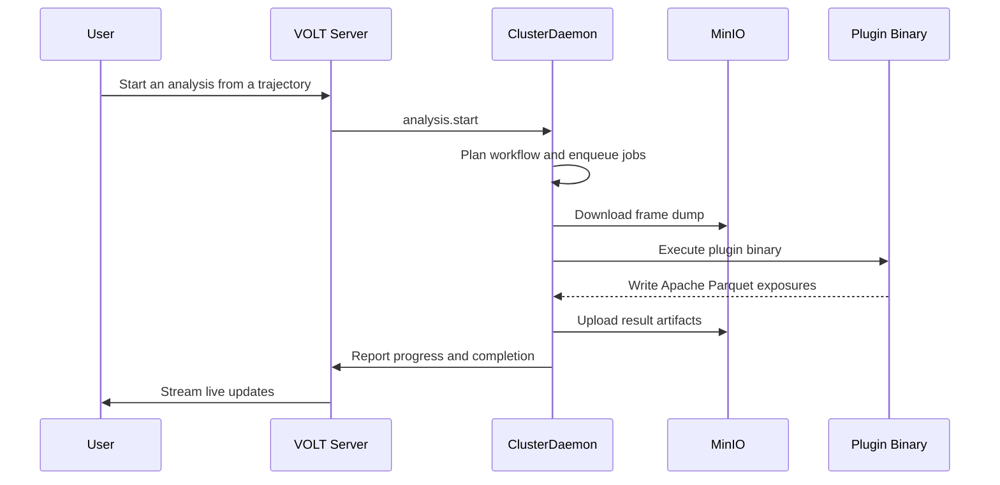

## The mental model

VOLT has three layers:

- the **workspace layer** — the application the team interacts with,
- the **runtime layer** — the daemon on connected machines,
- the **native/tooling layer** — the C++ and SDK ecosystem for parsing, analysis, 3D export, and automation.

Coordination is central; data and execution stay local to team-controlled machines.

## System overview

## The workspace layer

The main VOLT application — a React client and an Express-based server. It handles authentication, team state, permissions, conversations, routes, APIs, and real-time events, and coordinates domain modules: trajectories, analysis, containers, scripting, LaTeX, chat, notifications, and AI. It does not store simulation data permanently.

## The cluster daemon layer

ClusterDaemon executes operations on cluster infrastructure. It connects outward to VOLT over a reverse control channel, so the cluster needs no inbound HTTP services. Once connected, it can:

- receive analysis requests,
- maintain heartbeats and metrics,
- orchestrate job queues,
- parse and preprocess trajectories pulled from object storage,
- generate GLB models and preview rasters,
- create Jupyter runtimes,
- proxy access to managed data services (MinIO, MongoDB, and Redis explorers) and container HTTP/WebSocket ports,
- and coordinate artifacts and exports.

## Data flow for analysis

The daemon transforms plugin output into Apache Parquet data, listings, exports, and 3D artifacts for the viewer.

## Data flow for trajectories

Trajectory handling follows the same layered pattern; the full pipeline is documented in [Trajectories](/docs/modules/trajectories#processing-pipeline).

## Workflow runtime versus plugin binaries

A plugin is a node-based workflow with arguments, context, iteration, exposures, and exports. The runtime resolves it into one or more binary or Python execution steps: the workflow engine handles structural logic around `context`, `forEach`, `arguments`, and branching nodes; the job runtime turns the plan into frame-level work — download inputs, resolve the plugin payload, execute it, process the artifacts. See [Plugin System](/docs/plugins) for node-level details.

## Native tooling and open-source layers

| Tool | Role in the Runtime |
|---|---|
| **CoreToolkit** | Shared C++ foundation used by the scientific plugin binaries |
| **LammpsIO** | Native parsing of LAMMPS-oriented data |
| **SpatialAssembler** | Conversion of structured output into GLB geometry |
| **HeadlessRasterizer** | Rendering of GLB assets into PNG previews |
| **VoltSDK** | Programmatic access for external automation and notebooks |

## Networking and operational shape

| Connection | Direction | Why It Exists |
|---|---|---|
| Client to Server | HTTPS and WSS | UI, auth, APIs, and live updates |
| Server to Daemon | Reverse control over WebSocket | Job dispatch, remote operations, cluster lifecycle |
| Daemon to MinIO | HTTP(S) | Artifact and dump upload/download |
| Daemon to MongoDB | TCP | Metadata and listings |
| Daemon to Redis | TCP | Queues, state, and caching |
| Daemon to Docker | Unix socket | Containers and Jupyter runtimes |

## Bootstrap plane vs control plane

The cluster lifecycle has two phases:

| Phase | Role | Covers |
|---|---|---|
| **Bootstrap plane** | Installs and enrolls the cluster | Install material generation, environment and compose file writing, local service startup, and initial daemon announcement |
| **Control plane** | Keeps it operational after enrollment | Heartbeats, reverse-channel commands, job dispatch, remote access, notebook sessions, exposure registry updates, and lifecycle events through the daemon connection |

The two phases fail independently: a machine may install correctly yet never become a healthy control-plane participant, or it may bootstrap once and later disconnect.

## Daemon startup order

ClusterDaemon starts in this sequence:

1. register the decorated command groups against the reverse channel,
2. bind the reverse channel to the VoltCloud and object-gateway connections,
3. connect local infrastructure (MongoDB, Redis, the analysis data store, and MinIO buckets),
4. mark the command registry ready and start the heartbeat plane,
5. open the cloud connections (cloud control, event channel, object gateway) and the local object-gateway server,
6. publish the daemon's own exposure and fetch the runtime configuration,
7. start the exposure registry,
8. initialize the `RuntimeRoleCoordinator`, which starts the trajectory frame-processing and rasterization workers and then, depending on the cluster's effective role, the compute workers (analysis, GLB conversion, artifact upload, and plugin warmup).

If MongoDB, Redis, MinIO, or Docker are unavailable locally, the daemon fails before the cloud side sees a meaningful runtime.

## Memory-aware runtime behavior

The daemon launcher (`scripts/start.js`) sizes the V8 heap before the process starts: it reads the cgroup limit under Docker (falling back to the host's total RAM) and sets `--max-old-space-size` to roughly 80% of that budget, bounded by a floor and a ceiling. It also injects `--expose-gc` for manual garbage collection. This keeps the heap inside the container's budget and avoids OOM-kills from sizing against host RAM.

## Exposure registry and service discovery

The exposure registry inspects managed containers, reads their labels, determines which services should be reachable through VOLT, and periodically publishes snapshots back to the server. Each published exposure carries one of three access modes — HTTP, WebSocket, or TCP — so proxied HTTP services and notebook targets become reachable without manual endpoint registration. (Interactive container VNC sessions are a separate server-side feature and are not produced by the exposure registry.)

## Shutdown behavior

On shutdown the daemon:

- shuts down debug sessions,
- stops its compute workers,
- removes its own exposure and stops the exposure registry,
- stops the object-gateway server,
- disconnects the cloud, event-channel, and object-gateway connections,
- stops the heartbeat plane,
- closes queue state,
- shuts down the plugin process pool,
- releases its local dependencies.

A clean stop looks different from a crash in the logs.

## Failure checklist

When VOLT misbehaves, check:

- cluster connection state,
- local platform dependency health,
- daemon memory budget (heap sizing relative to the container's memory limit),
- worker process state,
- and reverse channel liveness.
